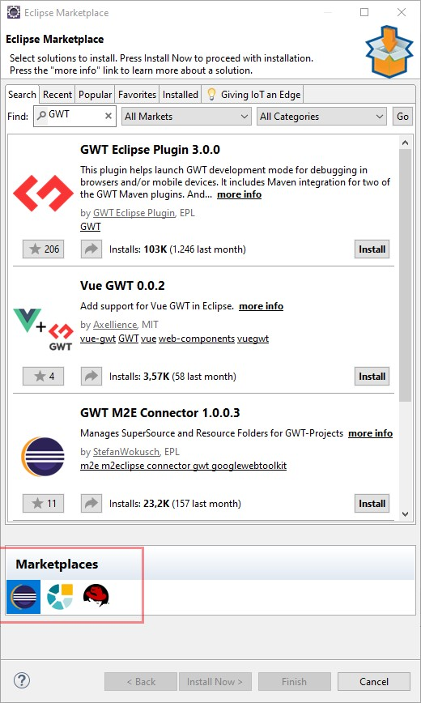

# Setup
## Install [Eclipse](https://www.eclipse.org/downloads/)

**DO THIS EVEN IF YOU ALREADY HAVE AN ECLIPSE INSTALLATION**
1. download and execute the installer

2. Select "Eclipse IDE for Enterprise Java Developers"

3. Change installation folder as desired

4. Java vm can be left as is

5. Select "INSTALL" and wait for installation to Complete

    (You may need to Accept some unsigned content)

6. Select Launch

7. Select the [eclipseWorkspace](../../eclipseWorkspace) directory in this repository

8.  Select Launch

## Install the GWT Eclipse plugin

1. In Eclipse select Help &rarr; Eclipse Marketplace...

2. Search for GWT

3. Hit Install on the "GWT Eclipse Plugin 3.0.0"

   (Make sure that the Eclipse Marketplace is Selected)

4. Hit Confirm

5. Accept the license agreements

6. Hit "Install anyways"

7. Restart Eclipse

## Install [AdoptOpenJdk](https://adoptopenjdk.net/)

Skip this if you already have a Java 8 JDK installed

1. Download OpenJDK 8 from [here](https://adoptopenjdk.net/?variant=openjdk8&jvmVariant=hotspot)
2. Execute the installer

## Set Correct JDK Version for in Eclipse
1. In Eclipse select Window &rarr; Preferences

2. In the Preferences Window select Java &rarr; Installed JRE

3. Add any Java 8 JDK

4. Set that JDK as the default

    [Screenshot of Preferences Window](./2.JPG)

